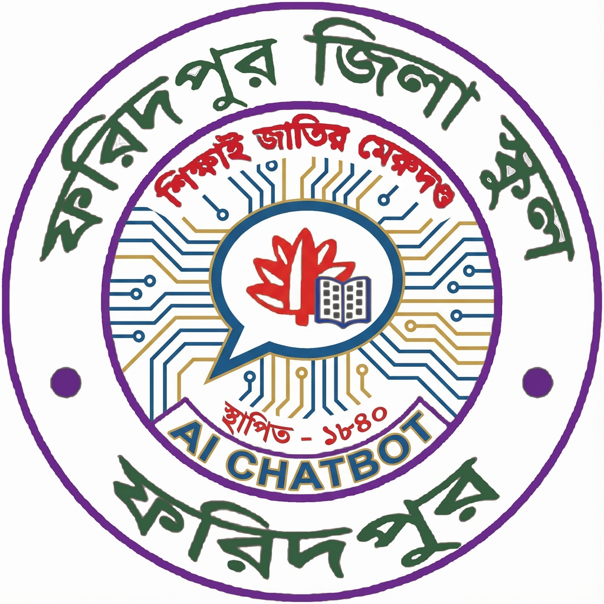

# 🎓 FZS School Chatbot

An intelligent bilingual chatbot for Faridpur Zilla School (FZS) providing instant information about the school in both Bengali and English.



## ✨ Features

- 🌐 **Bilingual Support** - Seamlessly switch between Bengali and English
- 🎨 **Multiple Themes** - 6 beautiful themes including dark, light, and colorful variants
- 💬 **Smart Responses** - AI-powered responses with school-specific knowledge
- 📱 **Responsive Design** - Works perfectly on desktop, tablet, and mobile
- ⚡ **Fast & Lightweight** - Built with Vite for optimal performance
- 👨‍🏫 **Comprehensive School Info** - Details about teachers, facilities, history, and more

## 🚀 Quick Start

### Prerequisites

- Node.js 18+ and npm installed ([install with nvm](https://github.com/nvm-sh/nvm#installing-and-updating))

### Installation

```bash
# Clone the repository
git clone <YOUR_GIT_URL>

# Navigate to the project directory
cd <YOUR_PROJECT_NAME>

# Install dependencies
npm install

# Start the development server
npm run dev
```

The application will be available at `http://localhost:8080`

### Build for Production

```bash
npm run build
```

The built files will be in the `dist` directory.

## 🛠️ Technology Stack

- **Framework**: React 18 with TypeScript
- **Build Tool**: Vite
- **Styling**: Tailwind CSS
- **UI Components**: shadcn/ui + Radix UI
- **Routing**: React Router v6
- **State Management**: React Hooks
- **Icons**: Lucide React

## 🎨 Themes

The chatbot comes with 6 stunning themes:
- 🌲 Dark Green (Default)
- 🌑 Dark Neutral
- ☀️ Light
- 🌊 Dark Blue
- 🌌 Dark Purple
- 🔥 Dark Orange

## 📁 Project Structure

```
src/
├── assets/          # Images and static assets
├── components/      # React components
│   ├── ui/         # Reusable UI components (shadcn)
│   └── ...         # Feature components
├── data/           # School data and constants
├── hooks/          # Custom React hooks
├── pages/          # Page components
├── utils/          # Utility functions
└── main.tsx        # Application entry point
```

## 🤝 Contributing

Contributions are welcome! Please feel free to submit a Pull Request.

## 📝 License

This project is open source and available under the MIT License.

## 🏫 About Faridpur Zilla School

Faridpur Zilla School is one of the oldest and most prestigious educational institutions in Bangladesh, established in 1853. This chatbot serves as a digital information hub for students, parents, and visitors.
